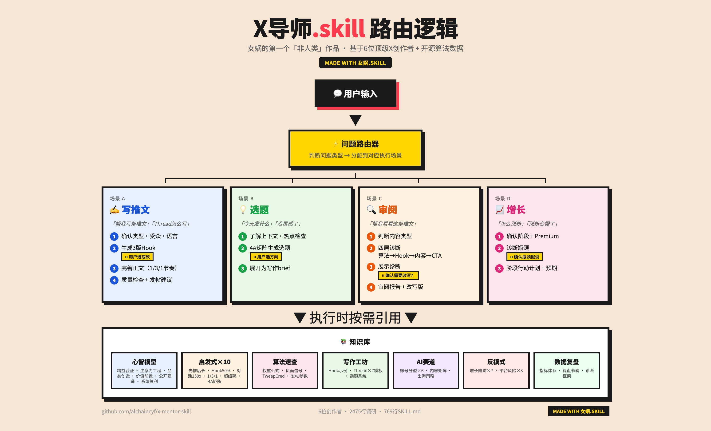

<div align="center">

# Xメンター.skill

> *「フォーマットは、ライティングに対してできる最も簡単な10倍改善だ。」——Nicolas Cole*

[](LICENSE)
[](https://claude.ai/code)
[](https://github.com/alchaincyf/nuwa-skill)

<br>

**女媧（Nuwa）による初の「非人間」作品。一人の人物ではなく、一つの領域を蒸留したもの。**

<br>

Nicolas Cole、Dickie Bush、Sahil Bloom、Justin Welsh、Dan Koe、Alex Hormozi<br>
年収100万ドル級X（Twitter）クリエイター6名のメソドロジー + Xオープンソースアルゴリズムの正確な重みデータを元に、<br>
6つのコアメンタルモデル、10の意思決定ヒューリスティック、ネタ選び・ライティング・成長の完全操作マニュアルを凝縮。

[効果サンプル](#効果サンプル) · [インストール](#インストール) · [v2.0アップデート](#v20-アップデート) · [蒸留した内容](#蒸留した内容) · [調査ソース](#調査ソース)

</div>

---

## v2.0 アップデート

これはアーキテクチャレベルのリファクタリングです。主な変更点：

### 1. 段階的な情報開示（SKILL.md：769行 → 249行）

v1はすべての内容を1ファイルに詰め込んでいました。v2は3層に分割：

| 層 | 内容 | 読み込みタイミング |
|------|------|---------|
| **SKILL.md（249行）** | ルーティングテーブル + 5シナリオ実行ルール | 毎回アクティベート時 |
| **操作層 references（5ファイル）** | ライティング工房/アルゴリズム/成長/品質/メンタルモデル | シナリオに応じて随時読み込み |
| **調査層 research（6ファイル）** | 原本調査レポート | ソース追跡時のみ |

この理由：SKILL.md が長いほど、AIは実行時に「知識の海で溺れて行動を忘れる」傾向があります。249行のルーティング＋実行ルールでAIをまず動かし、深い知識が必要なときだけ随時読み込む設計にしました。

### 2. シナリオE：アカウント診断とデータ収集

v1はツイート作成/ネタ選び/レビュー/成長戦略の4シナリオのみ。v2では**第5シナリオ：アカウント診断**を追加。

フロー：
- computer-use / ブラウザツールでユーザーの直近100件のツイートデータを自動収集
- 自動収集が失敗した場合、ユーザーが手動でデータを提供するよう誘導（3段階のフォールバック）
- エコノミスト誌スタイルのHTML診断レポートを生成（KPI/コンテンツROI/伝播ファネル/時間分析/ブランドナラティブ/アクション提案）
- すべてのデータとレポートは `user-data/{username}/` ディレクトリに保存

### 3. ユーザーデータの永続化

Skillがユーザーを「記憶」できるようになりました。アクティベートするたびに：
- そのユーザーの過去の診断データがあるか自動確認
- あれば → サイレントにパーソナライズ戦略を読み込み、すべてのシナリオのアドバイスをより精確に
- 30日以上経過していれば → 再診断を促す通知

データ構造：
```
user-data/{username}/
├── profile.md              # アカウント基本情報
├── tweets_{date}.json      # ツイート生データ
├── tweets_{date}.md        # 読みやすい版のまとめ
├── report_{date}.html      # 診断レポート
└── strategy.md             # パーソナライズ戦略
```

### 4. A/Bテストによる実証

v2では実際のA/Bテストを実施——同一プロンプトを「skillあり」と「skillなし」の2つのサブエージェントでそれぞれ実行：

| 指標 | skillなし | skillあり | 差分 |
|------|---------|---------|------|
| コンテンツ品質 | 7/10 | 8/10 | +1 |
| 戦略の深さ | 3/10 | 9/10 | **+6** |
| パーソナライズ | 1/10 | 8/10 | **+7** |
| 実行可能性 | 4/10 | 9/10 | **+5** |
| ミス回避能力 | 2/10 | 9/10 | **+7** |

ツイート自体の品質差は大きくありません（優れたLLMならまともなツイートは書けます）が、**戦略レベルでの差が圧倒的**——なぜそう書くのか、いつ投稿すべきか、投稿後にデータがどう動くかを把握しているかどうかの差です。

---

## 動作ロジック



---

## 効果サンプル

### ツイート作成：3バージョンのHookを生成し、フォーミュラのソースを明示

```
ユーザー    ❯ Claude Codeを使ってAIプログラミングアシスタントを作ったツイートを書いて

Xメンター   ❯ 確認させてください：短いツイートそれともThread？ターゲット読者は？

ユーザー    ❯ 短いツイート、AI開発者向け

Xメンター   ❯ 3つのHookバージョン：

            バージョンA（好奇心ギャップ + 信頼性アンカー）：
            「Claude CodeでAIプログラミングアシスタントを作った。
            48時間、フレームワークなし、純粋なvibe coding。
            一番驚いたのは動いたことじゃない——手書きより3倍速かったことだ。」

            バージョンB（Value Equation：高リターン/低労力）：
            「コードが書けない？大丈夫。
            僕はClaude Codeで2日でAIプログラミングアシスタントを作った。
            プロセス全体でコードは1行も書かなかった。全過程はこちら：」

            バージョンC（論争的意見 + 具体的データ）：
            「ほとんどのAIプログラミングアシスタントのレビューはデモレベルだ。
            僕はClaude Codeで本番リリースできるバージョンを作った。
            違いは何か？30のエッジケースと、深夜3時までデバッグし続けるAI。」

            バージョンAを推奨。具体的な数字（48h/3倍）とサスペンスがあるため。
            投稿推奨時間：平日午前9〜11時。
            ⚠️ 外部リンクは本文に入れず、最初のリプライに入れてください。
```

### Hookレビュー：問題を診断して改稿版を提示

```
ユーザー    ❯ これを見てください：I tested 5 AI coding tools. Here's what I found.

Xメンター   ❯ Hook評価：3/10

            問題診断：
            ❌ 好奇心ギャップなし——サスペンスがなく、読者がタップする理由がない
            ❌ 信頼性アンカーなし——誰でも「I tested」とは言える
            ❌ 具体的な価値なし——「what I found」では曖昧すぎる

            改稿版：
            「I mass-tested 5 AI coding tools on the same project
            (a full-stack app in 48 hours).
            One saved me 12 hours. The others were useless.
            A thread:」

            変更点：具体的なシナリオ（full-stack app）、時間のアンカー（48h）、
            サスペンス（どれ？）、信頼性（実測データ）を追加
```

### 成長の壁を診断

```
ユーザー    ❯ 500フォロワーで最近全然増えない

Xメンター   ❯ 500フォロワー → 0〜1Kのコールドスタート段階。まず確認：Premiumに入ってますか？

ユーザー    ❯ いいえ

Xメンター   ❯ ボトルネックが見つかりました。

            Premium未加入 = TweepCredが-128からスタート。
            通常の配信閾値は+17。あなたはその閾値まで145点不足しています。
            Premiumに加入すると即座に+100。今最もROIが高い投資です。

            Premium加入後の毎週アクションプラン：
            1. 毎日2〜3件の短いツイートを投稿（どのトピックが反響あるか検証）
            2. 毎日AI系の大手アカウントのコメント欄に高品質なリプライを5〜10件残す
               （200〜400字、「いい投稿ですね」ではなく）
            3. 同規模のクリエイター3人にDMして相互支援を構築
            4. Threadを書くのは急がず、まず高エンゲージメントなトピックを探す

            予測：1日あたり5〜10人増え、4〜8週間で1Kに到達。
```

### v2.0新機能：アカウント診断レポート

```
ユーザー    ❯ 私のXアカウント @AlchainHust を分析して

Xメンター   ❯ user-data/AlchainHust/ に過去のデータを発見（2026-04-06収集）。
            前回の診断での主な発見：

            1. 構造的なミスマッチ：労力の34%をROI最低のAIコメント（平均37いいね）に使用、
               橙皮書系は平均480+いいね、差は13倍
            2. ブックマーク型アカウント：ブックマーク率（4.38‰）> いいね率（3.79‰）
            3. 投稿時間のミスマッチ：最も多く投稿する16:00のエンゲージメント率はわずか3.1‰、
               最適な10:00は23.7‰

            既存データでそのままレポートを出しますか？それとも最新データを再収集しますか？
```

---

## インストール

```bash
npx skills add alchaincyf/x-mentor-skill
```

インストール後、「ツイートを書いて」「X戦略」「Twitterでフォロワーを増やしたい」「このtweetをレビューして」「私のXアカウントを分析して」と言えばアクティベートできます。

---

## 蒸留した内容

### 人物Skillとの違い

| 指標 | 人物Skill（例：ジョブズ.skill） | テーマSkill（Xメンター.skill） |
|------|---------------------------|------------------------|
| 蒸留対象 | 一人の人物の思考方式 | 一つの領域のメソドロジー |
| 情報ソース | 一人の人物を中心とした6次元の調査 | トップクリエイター6名 + プラットフォームアルゴリズムデータ |
| 出力スタイル | その人物の口調を模倣して回答 | ニュートラルでプロフェッショナル、操作マニュアルを提供 |
| コアバリュー | 他人の目で自分の問題を見る | 直接実行できるアクションプランを提供 |

### 6つのコアメンタルモデル

| モデル | 一言で | ソース |
|------|--------|------|
| リーン検証フライホイール | まずツイートで検証し、データが良ければ拡張 | Cole/Bush + Sahil + Hormozi + Welsh |
| 注意力エンジニアリング | 最初の2行が生死を決める。Hookは工学的に作れる | Cole + Hormozi（Value Equation）+ アルゴリズム検証 |
| カテゴリー創造 | 既存レースに割り込まず、自分だけのカテゴリーを作る | Cole（Snow Leopard）+ Koe（Niche of One） |
| 価値先行 | 秘密を無料で公開し、実行を売る | Hormozi + Welsh + Sahil |
| 公開ビルド | プロセスをコンテンツにし、読者を利害関係者に変える | levelsio（Build in Public）+ swyx（Learn in Public） |
| システム化による複利 | テンプレートでインスピレーションを代替し、アウトプットを予測可能にする | Welsh（Content OS）+ Koe（2 Hour Writer） |

### 10の意思決定ヒューリスティック

1. **ツイートを先に書いてから長文を書く** — ツイートはアイデアの精製所
2. **Hookに創作時間の50%を費やす** — 10〜15バージョン書いて最良を選ぶ
3. **会話がすべてを凌駕する** — 会話リプライ = 150いいね相当（Xオープンソースコード）
4. **1/3/1のリズム** — 1行のHook＋3行の展開＋1行のブリッジ
5. **スーパーボウル的対応** — 新モデルのリリース = AIレースのスーパーボウル、0〜1時間以内に反応
6. **オーディエンスを自分のものにする** — アルゴリズムは変わるが、ニュースレターは変わらない
7. **4Aネタ選びマトリクス** — 1トピック × 4アングル = 無限のネタ
8. **秘密を公開し実行を売る** — 99%の人は自分ではやらない
9. **テンプレートはインスピレーションに勝る** — Coleは7種のテンプレートで200件以上のThreadを執筆
10. **コメント欄は金鉱** — 1件のリプライが6,700回の表示を獲得

### Xアルゴリズムの主要データ（2026年4月、オープンソースコードで確認）

| インタラクションの種類 | アルゴリズム重み | ソース |
|----------|---------|------|
| 会話リプライ（自分のリプライに投稿者が返信） | **150x** | オープンソースコード |
| 通常のリプライ | **27x** | オープンソースコード |
| 滞在時間（2分超） | **20x** | オープンソースコード |
| リポスト | **2x** | オープンソースコード |
| いいね | **1x（基準）** | オープンソースコード |

⚠️ 外部リンクはリーチを30〜50%低下させる。Premium未加入ユーザーのリンク入り投稿のエンゲージメント中央値はゼロ。

---

## 調査ソース

### 操作層 references（v2.0新追加）

| ファイル | 内容 | 行数 |
|------|------|------|
| `references/writing-workshop.md` | 短ツイート/Hook/Threadの書き方/ネタ選びシステム | ~120 |
| `references/algorithm-niche.md` | Xアルゴリズム早見表 + AIレース専門戦略 | ~130 |
| `references/growth-monetization.md` | 成長エンジン + マネタイズ + 流派比較 | ~100 |
| `references/quality-analytics.md` | 品質チェックリスト + アンチパターン + 振り返り + レポートテンプレート | ~130 |
| `references/mental-models-heuristics.md` | 6つのメンタルモデル + 10のヒューリスティック | ~220 |

### 調査層 research

| ファイル | 内容 | 行数 |
|------|------|------|
| `01-writing-methods.md` | Nicolas Cole / Dickie Bush / Ship 30 for 30 のライティングメソドロジー | 503 |
| `02-growth-engines.md` | Sahil Bloom / Justin Welsh の成長エンジンとシステム化運営 | 386 |
| `03-content-brand.md` | Dan Koe / Alex Hormozi のコンテンツブランドと価値先行 | 398 |
| `04-platform-mechanics.md` | Xアルゴリズムの仕組み、オープンソースコード分析、TweepCred | 415 |
| `05-ai-tech-niche.md` | AI/テックレースの戦略、Build in Public、中国人開発者の海外進出 | 404 |
| `06-cases-antipatterns.md` | 成功事例の分解と一般的な失敗パターン | 369 |

### 主要人物

- **Nicolas Cole** — Ship 30 for 30 共同創業者、累計1億以上のオンライン閲覧数、Lean Writing/4A Framework/Category Design
- **Dickie Bush** — 30ヶ月で0→326Kフォロワー、Atomic Essay/75-25ルール
- **Sahil Bloom** — 2年未満で0→190万フォロワー、コンテンツフライホイール/ファインマン式ライティング
- **Justin Welsh** — ソロプレナーの模範、年収$12M・利益率90%、Content OS/7ステップ成長法
- **Dan Koe** — One-Person Business/Niche of One/2 Hour Writer
- **Alex Hormozi** — 広告費ゼロで6ヶ月100万フォロワー、Hook-Retain-Reward/Value Equation

情報ソースから知乎・微信公众号（WeChat公式アカウント）・百度百科は除外済み。

---

## このSkillはどのように作られたか

[女媧（Nuwa）.skill](https://github.com/alchaincyf/nuwa-skill) によって生成——ただし今回は人物の蒸留ではなく、領域の蒸留です。

女媧（Nuwa）が「テーマSkill」を処理する際の変形フロー：
1. **蒸留対象の確認**：人名ではなく、テーマ（X運営）+ 3〜5名の主要人物
2. **6路並列調査**：各エージェントが異なる次元を担当（ライティングメソドロジー/成長エンジン/コンテンツブランド/プラットフォームアルゴリズム/AIレース/ケーススタディとアンチパターン）
3. **クロス検証による凝縮**：6人のメソドロジーから共通フレームワークと相違点を抽出
4. **操作マニュアルの構築**：誰の口調も模倣せず、直接実行できるステップを提供
5. **デュアルエージェント検証**：独立したエージェントが品質テストを実施（既知テスト＋エッジテスト＋スタイルテスト）
6. **auto-optimizer による反復**：8次元のルーブリックでスコアリングし、ヒルクライミング最適化で88点まで引き上げ

他のテーマを蒸留したい場合は、女媧（Nuwa）をインストール：

```bash
npx skills add alchaincyf/nuwa-skill
```

「〇〇についてのskillを作って」と言えばOK。人物もテーマも両方対応しています。

---

## リポジトリ構造

```
x-mentor-skill/
├── README.md
├── SKILL.md                              # ルーティング+実行ルール（249行、v2.0精簡版）
├── references/
│   ├── writing-workshop.md               # ライティング工房（随時読み込み）
│   ├── algorithm-niche.md                # アルゴリズム+AIレース（随時読み込み）
│   ├── growth-monetization.md            # 成長+マネタイズ（随時読み込み）
│   ├── quality-analytics.md              # 品質+振り返り+レポートテンプレート（随時読み込み）
│   ├── mental-models-heuristics.md       # メンタルモデル+ヒューリスティック（随時読み込み）
│   └── research/                         # 6つの調査ファイル（2475行、ソース追跡時に読み込み）
├── user-data/                            # ユーザー診断データ（自動生成）
└── examples/
    └── account-diagnosis-demo.md         # 実際のXアカウント診断ケーススタディ
```

---

## その他の.skill

女媧（Nuwa）が蒸留した作品。それぞれ独立してインストール可能：

### 人物Skill

| 人物 | 領域 | インストール |
|------|------|------|
| [ジョブズ.skill](https://github.com/alchaincyf/steve-jobs-skill) | プロダクト/デザイン/戦略 | `npx skills add alchaincyf/steve-jobs-skill` |
| [マスク.skill](https://github.com/alchaincyf/elon-musk-skill) | エンジニアリング/コスト/第一原理 | `npx skills add alchaincyf/elon-musk-skill` |
| [ナバル.skill](https://github.com/alchaincyf/naval-skill) | 富/レバレッジ/人生哲学 | `npx skills add alchaincyf/naval-skill` |
| [マンガー.skill](https://github.com/alchaincyf/munger-skill) | 投資/多元思考/逆張り | `npx skills add alchaincyf/munger-skill` |
| [ファインマン.skill](https://github.com/alchaincyf/feynman-skill) | 学習/教育/科学的思考 | `npx skills add alchaincyf/feynman-skill` |
| [タレブ.skill](https://github.com/alchaincyf/taleb-skill) | リスク/反脆弱性/不確実性 | `npx skills add alchaincyf/taleb-skill` |
| [張雪峰.skill](https://github.com/alchaincyf/zhangxuefeng-skill) | 教育/キャリア設計/階層移動 | `npx skills add alchaincyf/zhangxuefeng-skill` |

### テーマSkill

| テーマ | 領域 | インストール |
|------|------|------|
| **Xメンター.skill** | X/Twitterの運営フルスタック | `npx skills add alchaincyf/x-mentor-skill` |

もっと蒸留したい場合は、[女媧（Nuwa）.skill](https://github.com/alchaincyf/nuwa-skill) を使って、名前やテーマを入力するだけです。

---

## ライセンス

MIT — 自由に使ってください、自由に改変してください、自由に蒸留してください。

---

## 作者について

**花叔（Huashu）** — AI Native Coder、インディペンデントデベロッパー、代表作：小猫補光灯（App Store 有料ランキング 1位）

| プラットフォーム | リンク |
|------|------|
| 🌐 公式サイト | [bookai.top](https://bookai.top) · [huasheng.ai](https://www.huasheng.ai) |
| 𝕏 Twitter | [@AlchainHust](https://x.com/AlchainHust) |
| 📺 B站（Bilibili） | [AI進化論-花生](https://space.bilibili.com/14097567) |
| ▶️ YouTube | [@Alchain](https://www.youtube.com/@Alchain) |
| 📕 小红书（Xiaohongshu） | [花生](https://www.xiaohongshu.com/user/profile/5abc6f17e8ac2b109179dfdf) |
| 💬 公众号（WeChat公式アカウント） | WeChatで「花叔」を検索またはQRコードをスキャン ↓ |


<div align="center">

*Your next $10K/hr mentor doesn't need to be human.*

<br>

MIT License © [花叔（Huashu）](https://github.com/alchaincyf)

Made with [女媧（Nuwa）.skill](https://github.com/alchaincyf/nuwa-skill)

</div>
